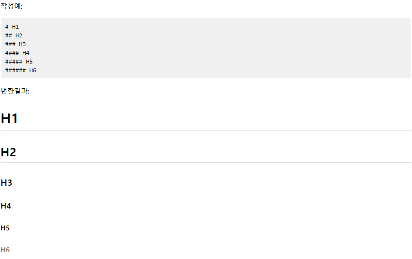
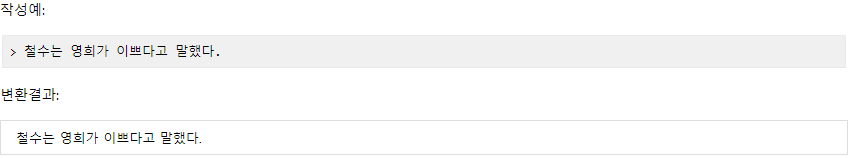
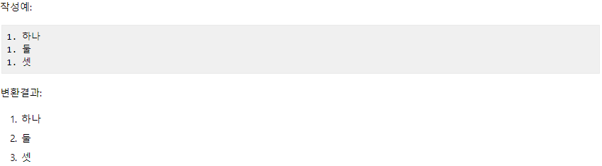
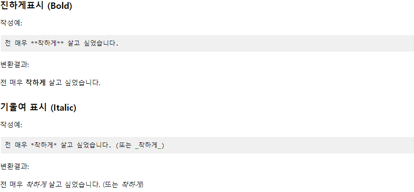
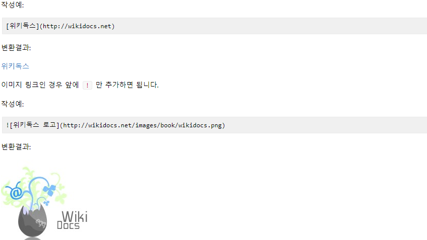
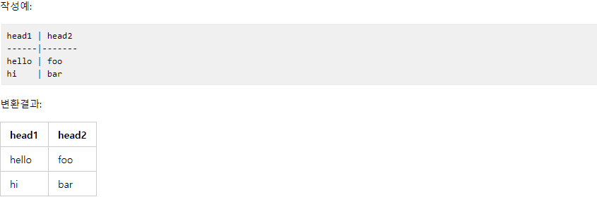

## **Markdown** (마크다운)
 텍스트 기반의 마크업언어로 특수기호와 문자를 이용한 매우 간단한 구조의 문법을 사용하여 웹에서 보다 빠르게 컨텐츠를 작성하고 보다 직관적으로 인식할 수 있다.

### 장점
1. 간결함
1. 별도의 도구없이 작성가능
1. 다양한 형태로 변환 가능
1. 지원하는 프로그램과 플랫폼이 다양

### 단점
1. 표준이 없음 (도구에 따라서 변환 방식이나 생성물이 다름)
1. 모든 HTML 마크업을 대신하지 못함

### 예)
#### HeadingMark

#### blockquote

#### List

#### Bold

#### Img

#### table

## **Pseudocode** (의사코드)  
 프로그램이나 알고리즘을 프로그래머가 이해할 수 있는 언어로 표현하는 것
> 목적과 수행과정이 명확해 코드 수정과 분해가 편리함

## **Algorithm** (알고리즘) 
 목표를 달성하거나 결과물을 생산하기 위해 필요한 과정

### **Conditions**
1. 외부에서 오는 값이 있어야함
1. 1개 또는 1개 이상의 결과가 있어야함
1. 간단함
1. 명확성(Clarity)   

>#### 명확성(Clarity)
#### time complexity == big O notation   
자료의 수 (n)이 증가할 때 시간의 증가 패턴을 나타낸 것
#### big O notation ?   
1   
log n   
n   
n log n   
n2   
n3  
2n   
n!

>O(1) : Constant   
값에 대한 키 또는 인덱스를 알고 있을 경우

>O(log n) : Logarithmic   
배열에서 값을 접근할 때 앞 또는 뒤에서 접근 선택이 가능

>O(n) : Linear   
자료의 수와 시도횟수가 1:1 관계인 경우

>O(n2) : Quadratic   
자료의 참조를 이중으로 하게 될 경우 (이중 for문)

## **Sort algorithms** 
* **O(n2)**   
    * Bubble sort : 1:1로 n(n-1)/2 번 수행하는 방법
    * Selection sort : 가장 가까운 값 부터 차례대로 정렬
    * Insertion sort : n번째 요소를 처음부터 n-1번째까지 비교하면서 값을 끼워넣는 법

* **O(n log n)**   
    * Merge sort :두개씩 쪼개어 각각 비교하여 정렬하는 방법
    * Heap sort : 데이터를 힙에 넣은 뒤 최대값을 출력하고 힙에서 제거하여 나열
    * Quick sort : 피벗을 기준으로 큰 값 작은 값을 나눈 뒤, 피벗을 옮겨 다시 수행하는 방법

  영상 : <https://www.youtube.com/watch?time_continue=17&v=WaNLJf8xzC4>

## **자료구조**(Data Structure)
컴퓨터에서 데이터를 구성하는 특별한 방법으로 효율적으로 사용 가능
### Stack 이란?
추상 데이터 유형으로 요소 컬렉션으로 사용되며,
두 가지 주요 작업(Push, Pop)
* Push : 컬렉션 요소 추가
* Pop : 컬렉션 요소 제거
> **LIFO : Last In, First Out**

### Queue 이란?
대기열은 특정 종류의 추상 데이터 유형 또는 컬렉션으로,
컬렉션의 엔티티는 순서대로 유지(Push, Pop)
* Enqueue : 뒤쪽 터미널 위치에 객체 추가
* Dequeue : 앞쪽 터미널에서 부터 객체 제거
> **FIFO : First In, First Out**

영상 : <https://www.youtube.com/watch?v=9RHO6jU--GU>

### DOM 이란?
Documnet object modeling 객체를 모델화 시킨 것
