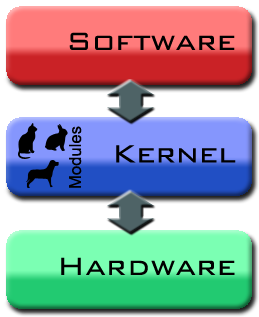
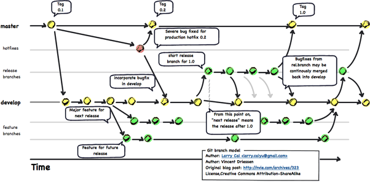

## **Linux**
리누스 토발즈가 작성한 커널 혹은 GNU 프로젝트의 라이브러리와 도구가 포함된 운영체제

### **Kernel (OS)**   
하드웨어와 응용프로그램을 이어주는 소프트웨어   

### **Shell**
커널과 사용자를 이어주는 소프트웨어

### **Bash 기본 명령어 및 설명**

>cd : 디렉토리 이동
>ls : 파일리스팅 (-la 추가시 목록으로 보여짐)       
>mkdir : 디렉토리 이동     
>touch : 파일 생성   
>mv : 파일 이동 (파일 이름 수정 가능)   
>cp : 파일 복사   
>rm : 파일 삭제 (-rf 추가시 디렉토리 삭제)   
>chmod : 파일 권한 주기     
ex) drwxr-xr-x   
d or - : 디렉토리 or 파일   
r : read   
w : write   
x : execute   
"-" :권한 없음   

**모든 권한은 8진수로 표현함**

### **Vim 기본명령어 및 설명**
>i or insert : 작성 모드   
>v : 비쥬얼 모드   
>d : 행 삭제   
>y : 복사   
>p : 붙여넣기   

> :q : 나가기   
> :q! : 저장을 안한 후 모든 경고 무시하고 나가기   
> wq : 저장하고 나가기

## **Git**
 소스 코드 관리를 위한 분산 버전 관리 시스템

### **Git의 장점**
- 2주만에 개발되어 단순한 구조로 빠른 속도를 자랑함
- 소스코드 주고받을 필요가 없이 동시작업이 가능 (생산성 ↑)
- 오프라인에도 개발 가능

### **Git 기본 사용법**
1. github.com에서 새로운 Repo 만들기
1. 터미널에서 레포이름과 같은 디렉토리 만들기
1. 디렉토리에서 $ git init
1. 새 파일 생성, 수정 및 저장
1. $ git add 파일이름
1. $ git commit -m "커밋메세지"
1. git push {레포 주소} master
1. github에서 반영 되었는지 확인

### **Git clone을 이용한 사용법**
1. github.com에서 새로운 Repo 만들기
1. 터미널에서 레포이름과 같은 디렉토리 만들기
1. git clone {레포 주소}
1. 새 파일 생성, 수정 및 저장
1. $ git add 파일이름
1. $ git commit -m "커밋메세지"
1. $ git push {레포 주소} master
1. github에서 반영 되었는지 확인

> 파일 수정시   
Add -> Commit -> Push 의 순서대로 진행

> 자주 사용하는 레포 주소는 아래와 같이 별명으로 설정 가능   
$ git remote add (별명) {레포 주소}

### **Git branch**
분기점을 생성하고 독립적으로 코드를 변경할 수 있도록 도와주는 모델

### **Git branch 명령어 및 설명**
>git branch (stem) : branch 생성   
>git checkout (stem) : branch 사용   
>git checkout -b (new-stem) : branch 새로 생성 후 사용   
>git branch -D (stem) : branch 삭제   

