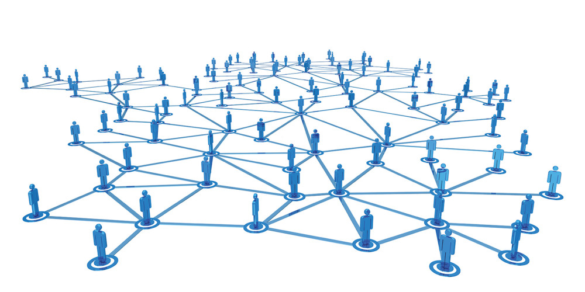
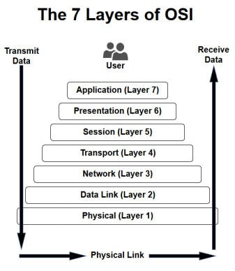
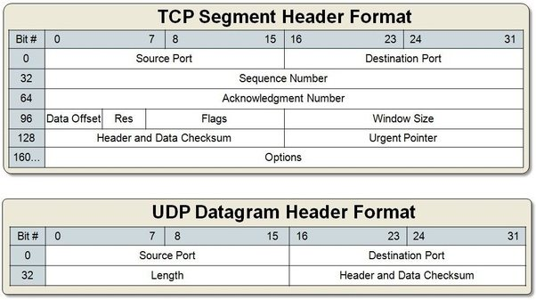

## **Network**
- 컴퓨터간 리소스를 공유 가능하게 만드는 통신망

### **특징**
1. 네트워크로 연결된 다른 컴퓨터에 접근하여 파일을 생성, 수정, 삭제가 가능
1. 프린터, 스캐너, 팩스 등 출력장치에 네트워크를 연결하여 여러 컴퓨터가 동시에 접근 가능   

### **종류**
1. 네트워크 케이블
1. 스위치 허브
1. 라우터
1. 네트워크 카드
 
#### **유선 : LAN, MAN, WAN**
>LAN (Local Area Network) : 근거리 통신망으로 학교,회사 등 가까운 지역의 좁은 범위   
>MAN (Metropolitan Area Network) : 도시권 통신망으로 도시나 지역 사회의 범위   
>WAN (Wide Area Network) : 광역 통신망으로 국가, 대륙 등 넓은 지역의 범위

#### **무선 : WLAN**
>WLAN (Wireess Local Area Network) : 무선 근거리 통신망으로 IEEE 802.11 표준을 기반하여 사무실, 집 정도의 범위

#### **여기서 잠깐! 802.11과 Wifi가 같을까?**
> 정답은 다르다.   
802.11은 IEEE에서 개발된 표준 무선 통신 기술을 뜻하며 Wifi는 802.11기술을 사용하는 무선 근거리 통신망이다. (802.11 > Wifi)

#### **이외의 네트워크 종류**
>Lifi (Light Fidelity) : IEEE 802.15.7r1 표준을 기반하여 빛에 직진성을 이용한 통신

#### **네트워크의 망 종류**
> Ring, Mesh, Star, Fully Connected, Line, Tree, Bus   

## **Network OSI 7 layer**(Open Systems Interconnection Reference Model)
국제 표준화기구에서 개발한 컴퓨터 네트워크 프로토콜 디자인과 통신을 계층으로 나눈 것   

### **네트워크 지원계층 (Layer 1~3)**
한 장치에서 다른 장치로 데이터를 이동할 때 전기적인 규격, 물리적인 연결, 물리 주소, 전송 시간과 신뢰도 등 물리적인 면을 처리 함   
Ex) ICMP, ARP, RARP, IP
1. **Physical layer (물리층)** : 네트워크 데이터가 전송될 때 사용되는 물리적 매개체로 물리적인 장치와 인터페이스가 전송을 위해 필요한 기능 및 처리 절차를 규정

2. **Data link Layer (데이터링크층)** : 물리적인 네트워크 사이의 데이터 전송을 담당하며 장비를 식별하는 데 사용되는 주소 지정 체계와 데이터가 변조되지 않았음을 확증하기 위해 오류 확인 제공

3. **Network Layer (네트워크층)** : 패킷을 발신지로부터 여러 네트워크를 통해 목적지까지 전달함

### **전송층 (Layer 4)**
종단대 종단간 신뢰 할 수 있는 데이터 전송 보장   
Ex) 4) TCP, 8) UDP   

4. **Transport Layer (전송층)** : 지점과 지점 간의 오류가 없음을 보장하여 아래 계층(Layer 1, 2, 3)의 신뢰성 있는 데이터를 전송

### **사용자 지원계층 (Layer 5~7)**
서로 상관 없는 소프트웨어 시스템 사이의 상호 연동을 가능하게 함   
Ex) 1) HTTP, 2) FTP, 3) SMTP, 4) TCP, 5) IP, 6) DNS, Telnet, DHCP, TFTP   

5. **Session Layer (세션층)** :  세션 연결의 설정과 해제, 세션 메시지 전송 등의 기능을 함   
6. **Presentation Layer (표현층)** : 응용 계층으로 부터 전송 받거나 전달되는 데이터의 인코딩과 디코딩을 함   
7. **Application Layer (응용층)** : 네트워크 활동들에 대한 모든 기본적인 인터페이스 제공 

## 용어 설명   
1 ) **HTTP (HyperText Transfer Protocol)** : www상에서 정보를 주고 받는 프로토콜로 TCP, UDP를 활용   
2 ) **FTP (File Transfer Protocol)** : 서버와 클라이언트 사이에 파일을 전송하기 위한 프로토콜   
-> 보안에 매우 취약하며 현재는 보안이 강화된 FTPS, SFTP, SSH 등을 사용   
3 ) **SMTP (Simple Mail Transfer Protocol)** : Internet에서 메일을 보내기 위한 프로토콜   
4 ) **TCP (Transmission Control Protocol)** : 전송제어 프로토콜로 근거리 통신망이나 인트라넷, 인터넷에 연결된 컴퓨터에서 안정적으로, 순서대로, 에러없이 교환할 수 있게함   
5 ) **IP (Internet Protocol)** : 호스트의 주소지정과 패킷 분할 및 조립을 담당하며   
종류로는 IPv4(32bit), IPv6(128bit)가 존재함
6 ) **DNS (Domain Name System)** : 복잡한 Ip adress를 사람이 판별하기 쉬운 url로 매핑하는 시스템   
7 ) **서브넷 마스크 (Subnetmask)** : 커다란 네트워크를 효율적으로 분배하여 사용하기 위한 방법   
8 ) **UDP (User Datagram Protocol)** : 데이터그램을 전송하기 위한 프로토콜로 빠른 속도를 자랑하지만 단순하여 신뢰성이 낮고 데이터그램 도착 순서가 바뀌거나, 중복되거나, 통보 없이 누락되기도 함   

### **TCP vs UDP Segment**
TCP는 Stream 형식으로 에러가 있으면 다시 요청 가능하지만 UDP는 Datagram 형식으로 에러가 있던 말던 그냥 보내버림   

