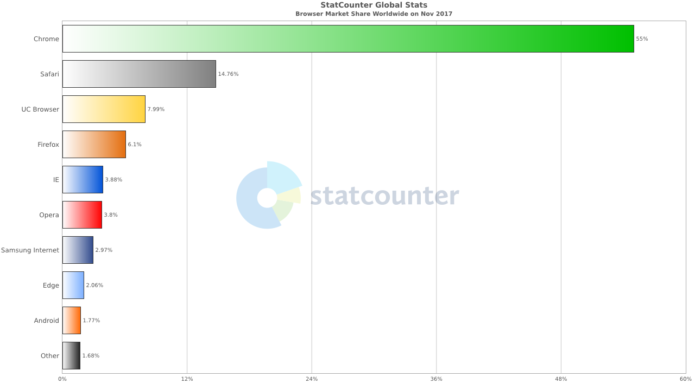
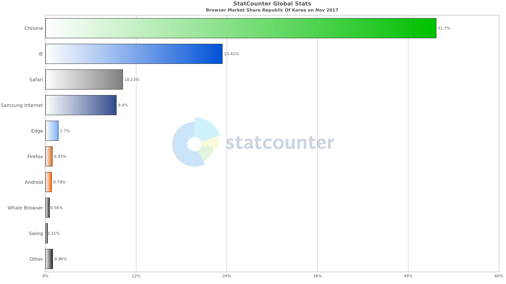
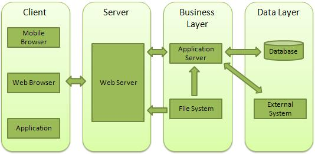
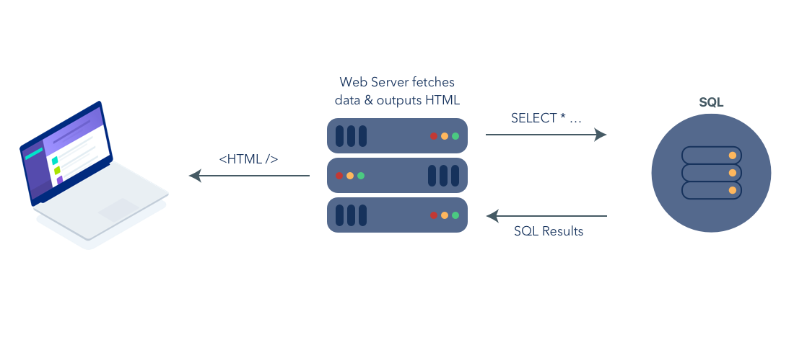
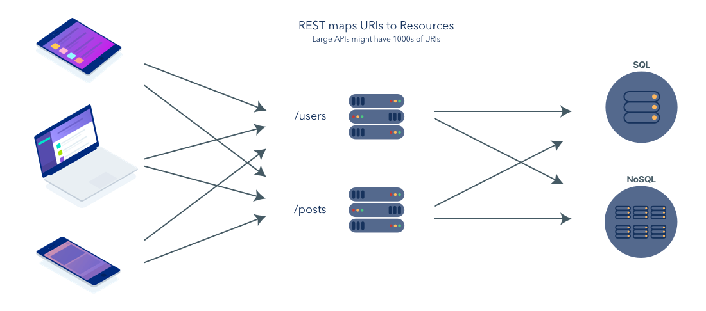
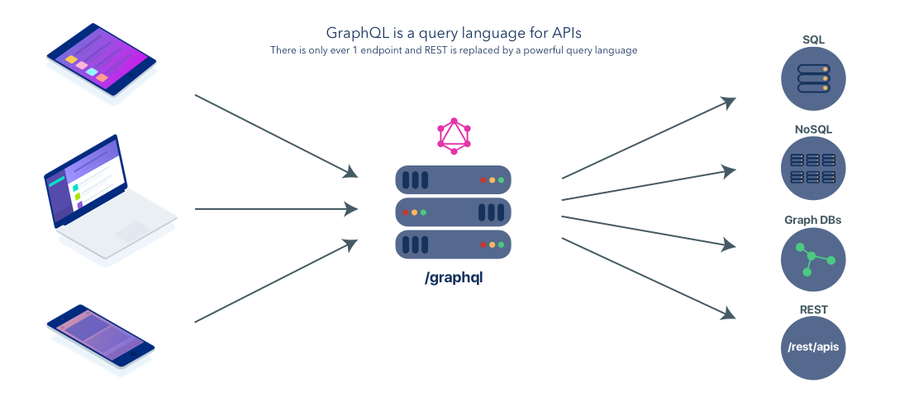

## **Socket**
네트워크상에서 서버와 클라이언트 두개의 프로그램이 특정 포트를 통해 양방향 통신이 가능하도록 만들어 주는 소프트웨어 장치

>간단하게 떨어져 있는 두 컴퓨터를 연결해주는 과정

### **Socket 암호화**
TLS (Transport Layer Security) : 프로토콜에 의한 암호화   
SSI (Secure Socket Layer) : 포트에 의한 암호화

## **Web Programming**
### **웹 개발 1세대** (1991 ~ 1999) 
하이퍼텍스트 기반의 프로젝트를 제안이 된 후 정적인 컨텐츠들을 중심으로 웹 기술이 발달    
-> 정적 웹 페이지 多

### **웹 개발 2세대** (1999 ~ 2009)
Linux, Apache, Mysql, Php 중심의 동적인 서버, 정적인 클라이언트 모델이 지속됨   
-> 정적 웹 페이지가 점점 감소하며, 동적 웹 페이지가 多

### **웹 개발 3세대** (2000 ~ 현재)

JavaScript에서 클라이언트와 서버를 같은 언어로 구현 가능해짐   
-> 동적 웹 페이지 多

### **여기서 잠깐 정적 웹 페이지와 동적 웹 페이지가 어떤 것일까?**

> 정적 웹 페이지 : 서버(Web Server)에 미리 저장된 파일(HTML 파일, 이미지, Javascript 파일 등)이 그대로 전달되는 웹 페이지   
> 동적 웹 페이지 : 서버(Web Server)에 있는 데이터들을 스크립트에 의해 가공처리한 후 생성되어 전달되는 웹 페이지

### **정적 웹 페이지**
1. 요청에 대한 파일만 전송하면 되기 때문에 추가적인 작업이 필요없음
1. 저장된 정보만 보여줄 수 있음
1. 추가/수정/삭제의 작업 모두 수동으로 작업해야함 
  
예) 같은 페이지에 다른 정보들을 요청하는 100 페이지가 들어오면 100페이지를 전부 작업

### **동적 웹 페이지**
1. 사용자에 웹 페이지를 전달하기 전에 처리하는 작업이 필요
1. 다양한 정보를 조합하여 동적으로 생성하여 제공가능
1. 추가/수정/삭제의 작업에 용이함   

예) 같은 페이지에 다른 정보들을 요청하는 페이지가 100페이지 들어오면 관련 데이터를 DB(Database)에서 받고 1페이지만 작업 

## **Web Browser**
웹 서버에서 쌍방향 통신하는 HTML 문서나 파일과 연동하고 출력하는 응용 소프트웨어   
Mosaic(1993) -> netscape(1994) -> Internet Explorer(1995) -> FireFox(2004) -> Chrome(2008) 

#### 현재 전 세계 웹 브라우저 점유율(2017.12)

#### 현재 한국 웹 브라우저 점유율(2017.11)   

## **Web architecture**

## **URI, URL, URN**
URI (Uniform Resource Information) : 모든 정보의 리소스를 가리키는 식별자
http://www.example.com/post/how-to-make-url   
-> 프로토콜 + 도메인 + Path + 파일이름

URL (Uniform Resource Locator) : 리소스의 위치를 나타내는 것   
https://www.example.com/post/   
-> 프로토콜 + 도메인 + Path

URN (Uniform Resource Name) : 리소스의 이름을 나타내는 것   
www.example.com/post/how-to-make-url   
-> 도메인 + Path + 파일이름

## **API** (Application Program Interface)
응용프로그램에서 사용할 수 있도록 운영체제나 프로그래밍 언어가 제공하는 기능을 제어할 수 있게 만든 인터페이스

### **Web API**
웹서버 혹은 브라우저를 위한 API

### **REST API** (Representational State Transfer Application Programming Interface)
HTTP URL로 잘 표현된 리소스에 대한 행위를 HTTP Method로 정의하는 것
>무엇을 (HTTP URL로 정의 된 리소스) 어떻게(HTTP Method)한다

### **REST API 장/단점**
장점 : 스펙없이 기존의 HTTP를 이용해 요청을 처리할 수 있다.   
단점 : 사용할 수 있는 메소드가 4개(Get, Post, Put, Delete)며, 표준이 없다.

### **Graphql**
최신 응용 프로그램의 복잡하고 중첩 된 데이터 종속성을 설명하기 위해 고안된 데이터 쿼리 언어

### **Graphql 장/단점**
#### 장점
- 요청에 따른 응답데이터 구조를 예측 가능
- 직관적
- REST API의 N+1 Problem을 해결 가능
- 확장이 용이함
#### 단점
- 코드가 추가되면서 단순한 App에서는 코드가 더 복잡해짐
- 출시한지 얼마 안되어 안정성 문제가 생길 수 있음