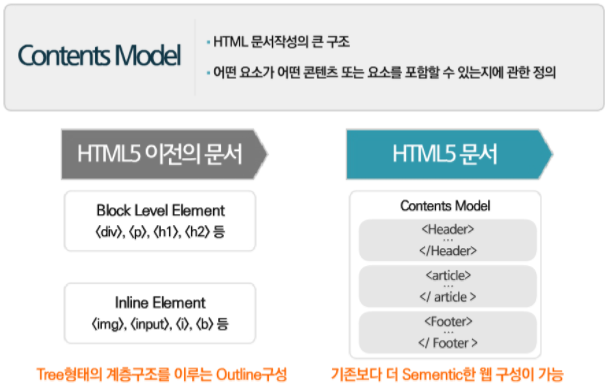
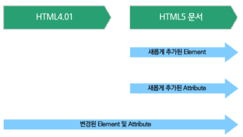
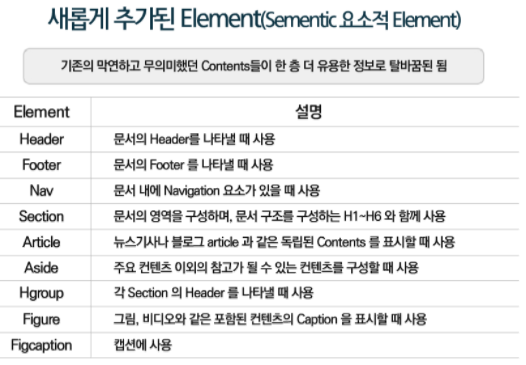
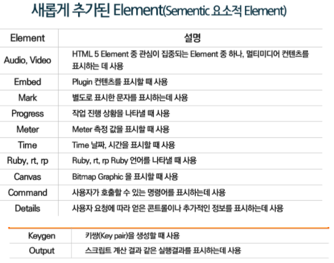
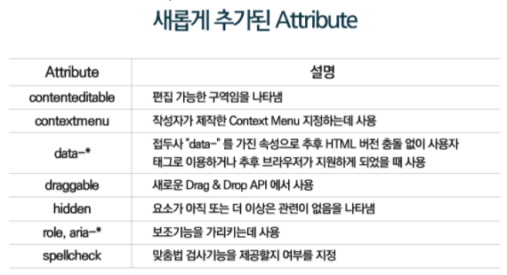
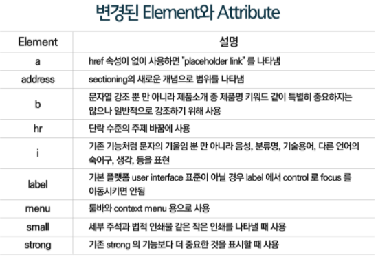
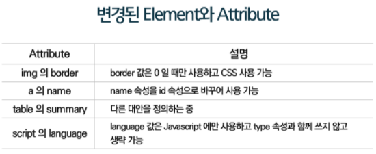
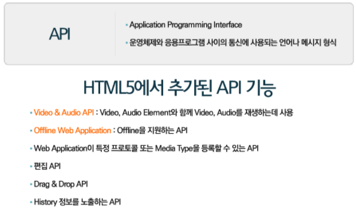

## **WWW**(World Wide Web)
인터넷에 연결된 컴퓨터들을 통해 사람들이 정보를 공유할 수 있는 전 세계적인 정보 공간

## **Web**
### **BACK-END**
사용자에게는 보이지 않는, 뒷면에서 작업이 이루어지는 단
> 서버 사이드
- JAVA
- JSP
- Spring
- Mysql

### **FRONT-END**
사용자와 직접 접촉하는 단
> 클라이언트 사이드
- HTML5
- CSS3
- Javascript

### **FRONT-END Web 기술의 설정값**
HTML5 : 뼈대   
CSS3 : 근사한 스타일링   
Javascript : 스마트한 두뇌   

### **Web 표준**(Web Standards)
웹(Web)에서 표준적으로 사용되는 기술이나 규칙

### **Web 접근성**(Web Accessibility)
장애를 가진 사람과 장애를 가지지 않은 사람 모두가 웹사이트를 이용할 수 있게 하는 방식

- 다양한 Platform
- Cross Browsing
- SEO (Search Engine Optimization)(검색 엔진 최적화)
- 저사양 또는 저속회선

---

## **HTML**
World Wide Web(www)을 위한 마크업 언어이며, 제목이나 문단, 표, 꼬리글 및 기타 요소를 이용하여 콘텐츠의 구조를 정의함으로써 웹 문서를 만드는 기능을 제공
- Markup의 기초 : HTML 문서는 요소(element)와 태그(tag) 그리고 콘텐츠로 구성되어 있으며, 요소는 HTML의 의미를 가짐

### **HTML5 탄생**
- 팀버너스리에 의해 설계되어 HTTP, URI, 브라우저와 함께 1990년에 개발
- 1999 ~ 2000년 HTML 4.01, XHTML 1.0이 권고
- 2000년 XHTML 1.0
- 2004년 Apple, Mozilla, Opera가 공통으로 WHATWG (Web Hypertext Application Technology Working Group) 발족 -> 널리 보급된 HTML에 기초하여 브라우저에 실제 구현된 기능을 중시, 현실적인 접근법을 채틱
- 2007년 W3C가 WHATWG와 공통으로 HTML5 제정에 합류
- 2008년 HTML 5 초안 공개
- 2009년 XHTML 2.0의 사양제정 중지

### **HTML4.01, XHTML1.0과 HTML5의 차이점**
#### 1. Contents Model의 추가
- HTML4.01보다 훨씬 더 시멘틱한 웹 구성이 가능해짐


#### 2. Language의 추가
- HTML4.01에서 HTML5로 개정이 되면서 이전 문서들과 다르게 추가되거나 변경됨






#### 3. API
- HTML4.01에서 HTML5로 개정이 되면서 새롭게 사용 가능한 API 기능이 추가됨


### **HTML 개발 순서**
**1. 구조설계 -> 2. 의미에 맞는 마크업 설정 -> 3. 네이밍 설정**   

### **HTML 실습 예제**
```cpp
<!DOCTYPE html> <!-- HTML5 선언 --> 
<html lang="ko">
<head>
  <!--인코딩을 UTF-8로 설정-->
  <meta charset="UTF-8">

  <!-- 파비콘 추가 -->
  <link rel="shortcut icon" href="./images/common/favicon.ico" type="image/x-icon">
  
  <!-- 사용자가 모바일에서 북마크나 바로가기 만들시 표시되는 아이콘 -->
  <link rel="apple-touch-icon" href="./images/common/favicon.ico"> 
  
  <title>웹카페 - HTML5,CSS3,Accessibility</title>
  
  <!-- css 추가 : style.css -->
  <link rel="stylesheet" href="./css/style.css"> 
</head>
<body>
</body>
</html>
```