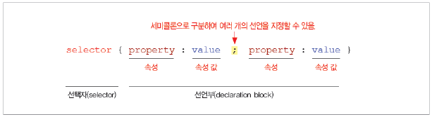
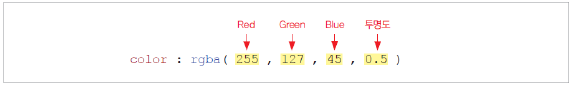
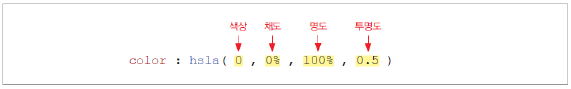
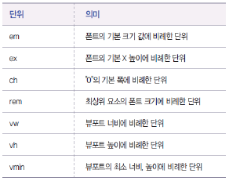
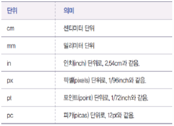
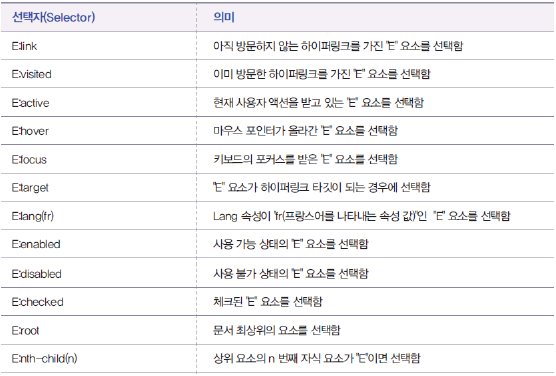
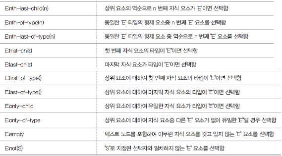

## **CSS3** (Cascading Style Sheet)
- W3C의 표준이며, 레이아웃과 스타일을 정의할 때의 자유도가 높은 언어

### **CSS3 탄생**
- 1996년 W3C의 주도하에 첫 번째 CSS 버전인 CSS Level 1 발표
- 1998 ~ 2000 CSS Level2가 등장하면서 대부분의 웹 브라우저가 css Level 2를 지원
- 그 후 CSS Level 2의 버그를 수정한 CSS Level 2.1이 2006년에 발표되면서 현재까지 표준으로 사용
- CSS Level 3는 CSS Level 2.1과 달리 모든 명세가 포함된 버전이 아닌 모듈 단위로 개발되고 있으며, 표 준화가 모듈 단위로 진행되고 있음.
  > 이 중 몇몇 모듈은 현재 Recomendation(권고안) 단계에 있으며, Working Draft(초안) 단계에 머물러 있는 모듈도 있음.

## **CSS 기초**
### **CSS 기본문법**

### **CSS 웹 브라우저별 접두사**
CSS3는 표준안이 확정되지 않은 상태이기 때문에 최신 웹 브라우저들은 CSS3 속성을 실험적으로 제공   
**(각 브라우저별 엔진 성능에 따라 보여지는 것과 제공하는 것이 다름)**
- 파이어폭스(Firefox) : -moz-
- 크롬, 사파리(Chrome, Safari) : -webkit-
- 오페라(Opera) : -o-
- 인터넷 익스플로러(IE) : -ms-
> 현재는 접두사를 안붙이는 추세로 바뀌고 있음

### **CSS 주석**
CSS 주석은 아래와 같이 사용함
<pre><code>/* 이곳은 주석입니다. */</code></pre>
css는 엔진 성능 차이

## **CSS 색상**
### **RGBA 형식**

### **HSLA 형식**

## **CSS 단위**
### **상대 단위**

### **절대 단위**

>주로 사용하는 단위 : px, em, rem, vw, vh

### **CSS 선택자**
- 전체 선택자 : 모든 요소를 선택하는 방법으로 "*"를 선택자로 선언
  <pre><code>*{
  margin:0;
  padding:0;
}</code></pre>
- 요소 선택자 : HTML 요소를 선택하는 방법으로 "h1", "p", "div"를 선택자로 선언   
  <pre><code>div{
  border:1px solid #e0e0e0;
}</code></pre>
- 클래스 선택자 : HTML 요소의 class 속성 값을 참조하여 설정하는 방법
  <pre><code>.header-div{
  font-size:12px;
}</code></pre>
- 아이디 선택자 : HTML 요소의 id 속성 값을 참조하여 선택하는 방법
  <pre><code>#main{
  background-color:#e0e0e0;
}</code></pre>
- 가상 클래스 선택자 : 요소의 상태나 상황에 따라 선택하는 방법으로, 링크의 경우 방문하기 전, 방문한 후, 링크 위에 마우스를 올려놓거나 포커스 시 등의 상황을 선택하여 스타일 지정이 가능

  <pre><code>.a:link{
  color:#red;
}</code></pre>
- 하위 선택자 : 선택자와 선택자를 공란으로 선언하며, 선행 선택자의 하위 요소 중 후행 선택자에 해당하는 요소를 선택하는 방법
  <pre><code>#main div{
  border:3px solid black
}</code></pre>