## **웹 접근성 - 한국형 웹 콘텐츠 접근성 지침**
### **1. 인식의 용이성**
 - **대체 텍스트**   
  1. 텍스트 아닌 콘텐츠는 그 의미나 용도를 인식할 수 있도록 대체 텍스트를 제공해야 한다.
      > 적절한 대체 텍스트 제공
 - **멀티미디어 대체 수단**   
  1. 멀티미디어 콘텐츠에는 자막, 대본 또는 수화를 제공해야 한다.
      > 자막 제공
 - **명료성**
  1. 콘텐츠는 색에 관계없이 인식될 수 있어야 한다.   
      > 색에 무관한 콘텐츠 인식
  2. 지시 사항은 모양, 크기, 위치, 방향, 색, 소리 등에 관계없이 인식될 수 있어야 한다.     
      > 명확한 지시 사항 제공
  3. 텍스트 콘텐츠와 배경 간의 명도 대비는 4.5 대 1 이상이어야 한다.
      > 텍스트 콘텐츠의 명도 대비
  4. 자동으로 소리가 재생되지 않아야 한다.
      > 자동 재생 금지
  5. 이웃한 콘텐츠는 구별될 수 있어야 한다.
      > 콘텐츠 간의 구분   

### **2. 운용의 용이성**
 - **입력장치 접근성**
  1. 모든 기능은 키보드만으로도 사용할 수 있어야 한다.   
      > 키보드 사용 보장
  2. 키보드에 의한 초점은 논리적으로 이동해야 하며 시각적으로 구별할 수 있어야 한다.   
      > 초점 이동
  3. 사용자 입력 및 컨트롤은 조작 가능하도록 제공되어야 한다.   
      > 조작 가능
 - **충분한 시간 제공**
  1. 시간제한이 있는 콘텐츠는 응답시간을 조절할 수 있어야 한다.
      > 응답시간 조절
  2. 자동으로 변경되는 콘텐츠는 움직임을 제어할 수 있어야 한다.   
      > 정지 기능 제공   
 - **광과민성 발작 예방**   
  1. 초당 3~50 회 주기로 깜빡이거나 번쩍이는 콘텐츠를 제공하지 않아야 한다.   
      > 깜박임과 번쩍임 사용 제한
 - **쉬운 내비게이션**
  1. 콘텐츠의 반복되는 영역은 건너뛸 수 있어야 한다.
      > 반복 영역 건너뛰기
  2. 페이지, 프레임, 콘텐츠 블록에는 적절한 제목을 제공해야 한다.
      > 제목 제공
  3. 링크 텍스트는 용도나 목적을 이해할 수 있도록 제공해야 한다.
      > 적절한 링크 텍스트

### **3. 이해의 용이성**
 - **가독성**
  1. 주로 사용하는 언어를 명시해야 한다.
      > 기본 언어 표시
 - **예측 가능성**
  1. 사용자가 의도하지 않은 기능(새 창, 초점에 의한 맥락 변화 등)은 실행되지 않아야 한다.
      > 사용자 요구에 따른 실행
 - **콘텐츠의 논리성**
  1. 콘텐츠는 논리적인 순서로 제공해야 한다.
      > 콘텐츠의 선형 구조
  2. 표는 이해하기 쉽게 구성해야 한다.
      > 표의 구성
 - **입력 도움**
  1. 사용자 입력에는 대응하는 레이블을 제공해야 한다.
      > 레이블 제공
  2. 입력 오류를 정정할 수 있는 방법을 제공해야 한다.
      > 오류 정정

### **4. 견고성**
 - **문법 준수**
  1. 마크업 언어의 요소는 열고 닫음, 중첩 관계 및 속성 선언에 오류가 없어야 한다.
      > 마크업 오류 방지
 - 웹 애플리케이션 접근성
  1. 콘텐츠에 포함된 웹 애플리케이션은 접근성이 있어야 한다.
      > 웹 애플리케이션 접근성 준수

### 자료 : 한국형 웹 콘텐츠 접근성 지침 참고

# **CSS 속성**
## **font-family**
텍스트의 폰트를 지정
<pre><code>font-family:"NanumGothic, sans-serif"</code></pre>
OR
<pre><code>font-family:"NanumGothic, serif"</code></pre>
> 코드 해석 : font-family에서 첫번째 "NanumGothic" 폰트가 없을시, "sans-serif" 나 "serif"를 사용 (최근에는 모바일 가독성 때문에 sans-serif를 많이 사용함)

## **nth-child**
### 1. nth-child(8)
 - 해당 요소의 8번째 요소만 변경가능하게 스타일을 줄 수 있음
 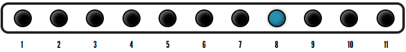
### 2. nth-child(n+6)
 - 해당 요소의 6번째 요소부터 모두 스타일을 줄 수 있음
 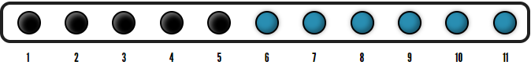
### 3. nth-child(-n+9)
 - 해당 요소의 반대쪽 9번째 요소부터 시작해서 모두 스타일을 줄 수 있음
 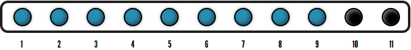
### 4. nth-child(n+4):nth-child(-n+8)
 - 해당 요소의 4번째 요소부터 반대쪽 8번째까지 스타일을 줄 수 있음
 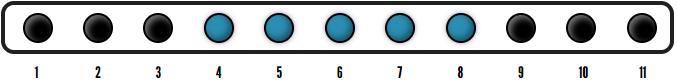
### 5. nth-child(n+2):nth-child(odd):nth-child(-n+9)
 - 해당 요소의 2번째 부터 반대쪽 9번째 요소까지의 홀수를 구할 수 있음
 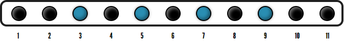
### 6. nth-child(3n+1):nth-child(even)
 - 해당 요소의 첫번째 부터 짝수를 구할 수 있음   (일반적으로 1, 4, 7, 10 이러한 식으로 흘러가지만 짝수만 포함하면 4와 10이 해당됨)   
 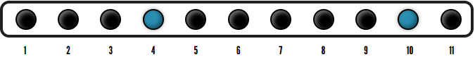

## **img(art 속성)**
``````   
 - art를 표시하는 이유는 이미지 경로가 안 맞을때 설명해주는 의도로 사용할 수 있는데 더 중요한 것은 장애를 가지신 분들도 정보를 얻을 수 있게 하기 위해 넣는 것이다.


# **Flexbox**
 - flex의 유연성을 뜻하며 요소들을 자유자제로 위치시키는 뜻입니다.
 > 새롭게 CSS3 명세에 반영된 레이아웃 모듈이며, 요소들이 수용된 공간을 어떻게 효과적으로 채워나갈지에 대해 고민하다가 만들어진 새로운 레이아웃 방식 

## **Flex Container - 부모**
##  **display**
그릇에 해당하는 부모 요소 (display: flex 혹은 display: inline-flex로 선언)
<pre><code>.flex-container { display: flex }</code></pre>
##  **flex-direction**
 컨테이너 안에 위치하는 자식 요소에 어떤 방향성을 줄 것인지 결정   

 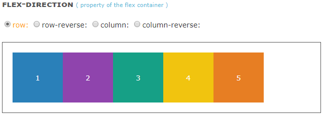
 <pre><code>.flex-container { 
   display: flex;
   flex-direction: row;
  }</code></pre>
  - row : 기본 값. 아이템이 수평방향(행)으로 흐르며, 방향성은 좌에서 우
  - row-reverse : 아이템이 수평방향(행)으로 흐르며, 방향성은 우에서 좌
  - column : 아이템이 수직방향(열)으로 흐르며, 방향성은 상에서 하
  - column-reverse : 아이템이 수직방향(행)으로 흐르며, 방향성은 하에서 상

## **flex-wrap**
줄 넘김 처리

 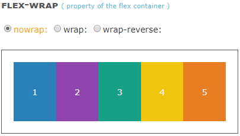
 <pre><code>.flex-container { 
   display: flex;
   flex-direction: row;
   flex-wrap: nowrap;
  }</code></pre>

 - nowrap : 기본 값. 아이템을 한 줄에 모두 표현
 - wrap : 아이템이 적정 길이 이상으로 길다면, 복수의 줄에 걸쳐 표현
 - wrap-reverse : wrap과 같지만, 방향성이 반전되어 표현. 한마디로, 역방향으로 줄 넘김이 발생

## **justify-content**
수평 방향으로 정렬하는 방식

 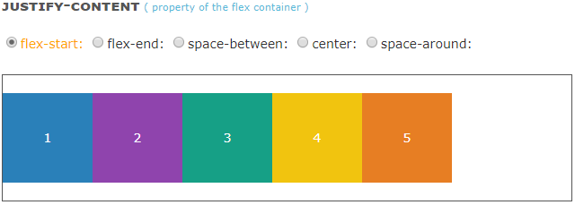
 <pre><code>.flex-container { 
   display: flex;
   flex-direction: row;
   flex-wrap: nowrap;
   justify-content: flex-start;
  }</code></pre>

 - flex-start : 아이템을 한 덩어리로 묶어, 수평방향의 시작 점에 위치
 - flex-enter : 아이템을 한 덩어리로 묶어, 수평방향의 끝 점에 위치
 - center : 아이템을 한 덩어리로 묶어, 수평방향의 중앙에 위치
 - space-between : 아이템을 컨테이너의 양쪽 끝에 맞춰 정렬
 - space-around : 컨테이너의 양쪽 끝을 기준으로 각 아이템의 전, 후에 일정한 간격의 공간을 만들어 정렬

 ## **align-items**
수직방향으로 정렬하는 방식

 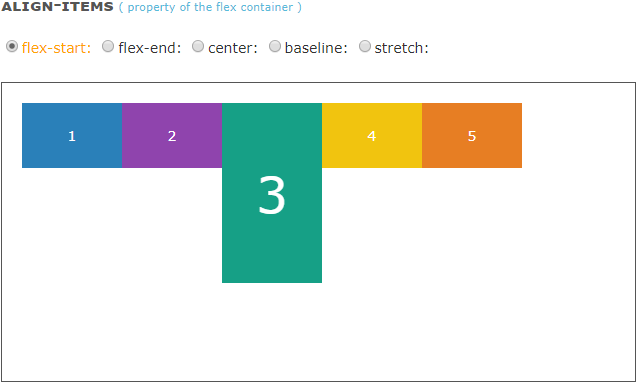
 <pre><code>.flex-container { 
   display: flex;
   flex-flow: row nowrap;
   align-items:flex-start;
  }</code></pre>

 - flex-start : 아이템을 한 덩어리로 묶어, 수직방향의 시작 점에 위치
 - flex-enter : 아이템을 한 덩어리로 묶어, 수직방향의 끝 점에 위치
 - center : 아이템을 한 덩어리로 묶어, 수직방향의 중앙에 위치
 - baseline : 아이템을 컨테이너의 baseline에 맞춰 정렬
 - stretch : 컨테이너의 양쪽 끝을 기준으로 각 아이템의 전, 후에 일정한 간격의 공간을 만들어 정렬

## **align-content**
한 줄을 넘기는 아이템들을 수직방향으로 정렬 ("align-itm"과 "justify-content" 속성을 모두 가지고 있음)

 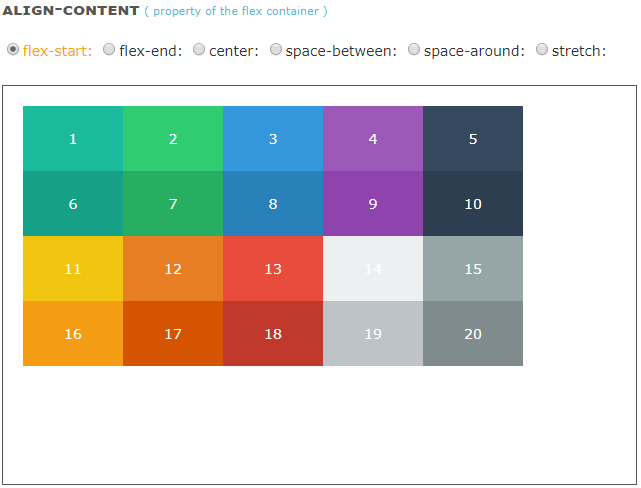
 <pre><code>.flex-container { 
   display: flex;
   flex-flow: row nowrap;
   align-items:flex-start;
  }</code></pre>

 - flex-start : 아이템을 한 덩어리로 묶어, 수직방향의 시작 점에 위치
 - flex-enter : 아이템을 한 덩어리로 묶어, 수직방향의 끝 점에 위치
 - center : 아이템을 한 덩어리로 묶어, 수직방향의 중앙에 위치
 - baseline : 아이템을 컨테이너의 baseline에 맞춰 정렬
 - space-between : 컨테이너의 수직방향 기준으로 아이템 사이의 줄(행)을 일정한 간격을 두고 정렬
 - space-around : 컨테이너의 양쪽 끝을 기준으로 각 아이템 줄(행)의 전, 후에 일정한 간격의 공간을 만들어 정렬
 - stretch : 컨테이너의 양쪽 끝을 기준으로 각 아이템의 전, 후에 일정한 간격의 공간을 만들어 정렬

 ### 자료 : beautifulcss님의 블로그 내용 참고