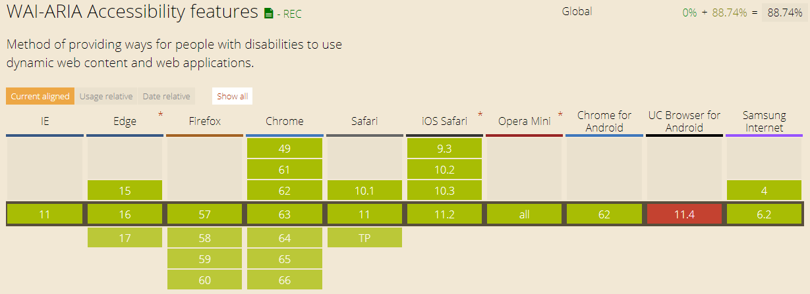

# **HTML 블럭 요소, 인라인 요소**

## **블럭 요소**
**화면의 가로폭 전체를 차지하는 직사각형 모양**
- p 요소
- h1 요소
- blockquote 요소
- ul 요소와 ol 요소
- li 요소
- div 요소

## **인라인 요소**
**블럭 요소 혹은 다른 인라인 요소 안에만 쓰일 수 있으며 CSS를 통해 스타일을 변경하지 않았다면 기본적으로 문장이 흐르듯 흐는 모양**
- a 요소
- strong 요소
- em 요소
- span 요소
> 인라인 요소는 블록 요소 안에 담겨있어야 하고 여러 인라인 요소가 서로 중첩될 수 있음

# **HTML5 time 요소**
기계가 이해할 수 있는 형태로 날짜나 시간을 나타내줌   

예제1)

        
강의 시작은 <time>20:00</time>입니다.

예제2)

        
강의 시작은 <time datetime="2018-01-23 20:00">1월 23일</time> 입니다..

# **WAI-ARIA(Web Accessibility Initiative Accessible Rich Internet Applications) - 웹 접근성**
**웹 사이트/애플리케이션에 접근성을 제공할 수 있도록 하는 표준**

## **브라우저 지원 현황**

> 우리나라에서 쓰기에는 Internet Explorer 버전 문제 때문에 아직 무리가 있음

## **ARIA의 3가지 기능**
### **역할**
1. 특정 요소에 기능을 정의
2. 역할을 부여하여 사용자에게 정보 제공
3. 부여된 역할은 동적으로 변경할 수 없음
> 추상 역할, 위젯 역할, 랜드마크 역할, 문서 구조

### **속성 & 상태**
1. 요소가 기본적으로 갖고 있는 특징이나 상황
2. 속성과 상태는 “aria-*” 접두어를 가짐
3. 상태는 요소의 상황을 나타내므로 애플리케이션이 실행 중에 자주 바뀌는 반면, 속성은 상대적으로 바뀌는 경우가 드뭄
> 위젯 속성, 라이브 영역 속성, 드래그 엔 드롭 속성, 관계 속성

## **NIA 한국 정보화진흥원 WAI-ARIA 자료 참고**