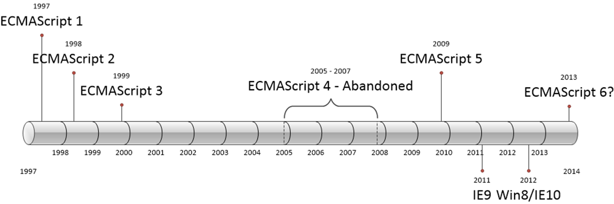

# 프로그래밍 언어
컴퓨터와 인간의 대화에 사용되는 일종의 수단으로 컴퓨터가 모두 이해할 수 있는 약속된 형태의 인공 언어

- 자연어를 가지고 사람이 이해할 수 있는 레벨로 인공어를 만든 언어
- Semantics(의미)와 Syntax(구문)의 조합으로 표현
- 컴퓨터에게 명령하는데 효율적(명확히)으로 전달하는 것
- 수행되어져야 하는 명령을 컴퓨터에 전달하는 일종의 커뮤니케이션

* 자연어 : 어떤 정돈된 완벽한 문법이나 형식적인 의미가 없는 언어
* 인공어 : 한 사람이나 여러 사람의 의도와 목적에 따라 만든 언어
* 언어 : 말로 표현할 수 있지만, 문서로도 표현할 수 있음

## 문제 해결 능력
프로그래밍을 정의하기 위해서는 문제 및 요구사항을 명확히 이해한 후 복잡함을 단순하게 분해해야 하는데 이때 요구되는 것이 문제 해결 능력

※ 문제 해결 능력과 알고리즘은 절대적이지 않음
   > 자료구조가 제일 중요함
## Computational thinking
해결 과제를 명확히 하여 문제를 작은 단위로 분해하고 패턴화 하고 컴퓨터가 효율적(명확히)으로 수행할 수 있도록 답을 내는 것

## 문법(Syntax)
우리는 항상 컴퓨터가 이해할 수 있는 언어인 기계어로 명령을 전달해야 하지만 컴퓨터가 이해할 수 있는 문법을 사용하여 프로그램을 작성한 후 기계어로 변환하여 주는 번역기를 이용할 수 있음
- 번역기를 컴파일러 혹은 인터프리터라고 함
> 결국 프로그래밍을 학습한다는 것이 문법을 배우는 것

## 의미(Semantics)
문법을 기초로 하여 내가 수행하고자 하는 것 즉, 요구사항이 실현되어야함
> 프로그래밍에서 제공하는 것들
  - 변수
  - 키워드
  - 연산자
  - 표현식
  - 조건문
  - 반복문
  - 함수
  - 자료구조

**결론 : 프로그래밍은 요구사항의 집합을 분석하여 적절한 자료구조와 함수의 집합으로 변환 후 흐름을 제어하는 것**

---

# Script란 ?
순차적으로 하나씩 실행되는 것

# Javascript란 ?
브랜던 아이크가 만든 1995년에 만들었던 스크립트 언어이며 HTML, CSS와 함께 구성하는 요소로 웹브라우저에 동작하는 유일한 언어
- C나 Java에서 많은 문법을 차용했고 그 이외에도 Awk, Perl,Python으로부터도 영향을 받음
- 인터프리터 언어이기 때문에 Compile 필요없이 HTML 안에 기술이 가능
- 멀티-패러다임 언어로 명령형, 함수형, *프로토타입 기반*으로 객체지향 언어로서 사용
- 구글의 Chrome V8 Javascript 엔진으로 빌드된 Javascript 런타인 환경인 Node.js의 등장으로 서버 사이드에서 Front-end 영역은 물론 Back-end 영역까지 아우르는 웹 프로그래밍 언어로 거듭남
- 크로스 플랫폼을 위한 모바일 웹/앱 개발 분야에서도 가장 중요한 언어로 주목받음
- SPA(Single Page Appliction) 웹 앱이 대중화되면서 Angular, React, Vue.js 등 다양한 프레임워크와 라이브러리가 확보

> Javascript는 웹페이지 제작에 보조적인 역할을 할라고 만들었다. 하지만 HTML5의 등장으로 사용빈도가 늘어나고 chrome V8이 만들어지면서 javascript가 브라우저환경에서만 사용되었지만 런타임 환경인 node.js의 등장으로 서버 사이드 애플리케이션 개발에서도 사용되는 full stack 개발 언어가 되었음

## Histroy
- 1995년 Navigator 2를 위하여 웹페이지에 포함하는 스크립트 언어로 개발되었으며 Livescript로 불리었음
- 1997년 ECMA-262라 불리는 명세가 완성되었으며 상표권 문제로 Livescript에서 ECMAScript로 변경
- 1999년 ECMAScript 3가 공개 되었음
- 10년뒤인 2009년 ECMAScript 5 HTML5와 함께 출현한 표준안(JSON과 Strict Mode가 추가됨)
- 2015년 ECMAScript 6가 공개 되었음(let, const 키워드, Arrow Function, class, Symbol 타입 등이 추가)
  > ES3에서 ES5사이에서 ES4가 받아들이지 않으면서 ES4에 있던 기능들이 ES6에 다 적용됨

## C언어와 Javascript의 동작
c언어는 운영체제가 실행하며 OS로 바로 명령함
Javascript는 OS위에서 구동하는 브라우저에서 동작하는 것

---

# http란?
단방향 통신
HTTP 1.1V은 하나 하나 다 요청해서 정보를 받아옴
HTTP 2.0V은 한번에 정보를 요청해서 받아옴
> 단점 : 서버안에 기록이 없음

## 렌더링 엔진 (HTML, CSS)
로드 -> 파싱 -> DOM에 저장 -> 렌더 트리로 결합
로드 -> 파싱 -> CSSOM에 저장 -> 렌더 트리로 결함

## 자바스크립트 엔진 (Javascript)
로드 -> 파싱 -> syntax에 저장 -> 렌더 트리로 결합

---

# Javascript Syntax Basics
## 구문(Statement)
Script가 컴퓨터에 의해 단계별로 수행될 명령들

	var x = 5;

예 ) 키워드 x라는 이름으로 변수를 생성하고 그 x라는 이름에 5라는 값을 넣어라

	var z = x + y;

예 ) 키워드 z라는 이름으로 변수를 생성하고 x,y라는 값을 가져와서 더한 다음 z에 넣어라

## 표현식 (Expression)
하나의 값으로 평가될 수 있는 구문
> 구문은 표현식이 될 수 없음

	10 * 6             // 60
	'Hi' + ' ' + 'bro' // 'Hi bro'

## 변수 (Variable)
변수는 위치를 기억하는 저장소이며 값을 저장, 참조하기 위해 사용

	var number;  // 변수의 선언과 초기화
	number = 6;

예) number로 변수를 선언하고 변수 number에 6을 할당해라

## 값 (Value)
여기서의 값을 보통 리터널이라 부름
> 리터널이란 : 변수 또는 상수에 저장되는 값 자체를 의미

	2000 // literal : Number
	'Hi Hello' // literal : String
	{ name: 'Park', age: '25' } // literal : Object
	['Spring','Summer']; // literal : Array

## 키워드

수행할 동작을 규정한 것(명령어)

## 주석 (Comment)

작성한 코드의 의미를 설명함
> 주석은 없는 것이 최고

변수명 프로퍼티명을 사용할 때 의미를 담아서 쓰는 것이 좋음

	//Bad
	//변수 x에 정수 5를 할당함
	var x = 5;
	
	//good
	var page = 10;

참고 : http://poiemaweb.com 사이트