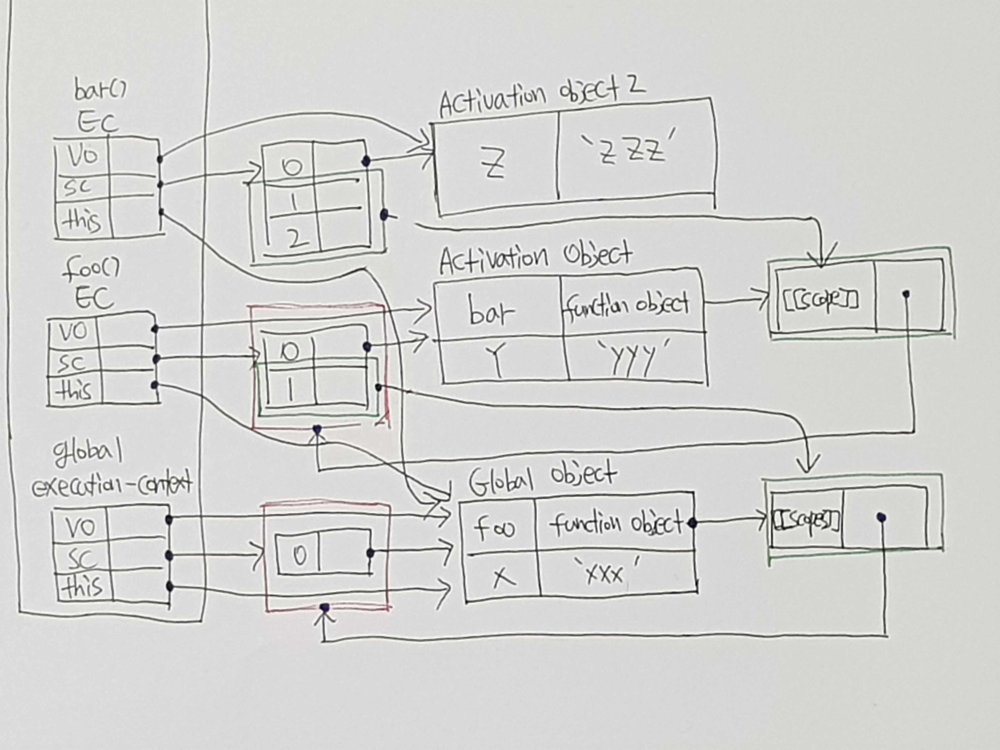

# 실행 컨텍스트

- Scope, Hoisting, This, Function, Closure 등의 **동작 원리**를 담고 있는 `Javascript의 핵심원리`

- ECMAScript 스펙에서는 실행 가능한 코드를 형상화 하고 구분하는 추상적인 개념

  > 실행 가능한 코드가 실행되기 위해 필요한 컨테이너 혹은 Wrapper


결국 실행 컨텍스트는 코드가 실행 되기 위해서는 코드를 형상화하고 구분해야 하는 공간(컨테이너 혹은 Wrapper)을 `실행 컨텍스트`라고 함  

## 실행 가능한 코드

- 전역 코드 : 전역 영역에 존재하는 코드

- Eval 코드 : Eval 함수로 실행되는 코드

  > Eval 코드는 사용안하는 것이 좋으므로 사용 X

- 함수 코드 : 함수 내에 존재하는 코드

## 실행에 필요한 정보

- 변수 
  - 전역변수
  - 지역변수
  - 매개변수
  - 객체의 프로퍼티
- 함수 선언
- 변수의 유효범위(Scope)
- this


## 실행 컨텍스트 스택(Stack)

실행 컨텍스트는 스택(Stack)으로 생성하고 소멸하며 스택의 구조인 FILO(First In Last Out)의 구조를 가짐


1. 컨트롤이 실행 가능한 코드로 이동하면 논리적 스택 구조를 가지는 새로운 실행 컨텍스트 스택이 생성
2. 전역 코드(Global code)로 컨트롤이 진입하면 전역 실행 컨텍스트가 생성되고 실행 컨텍스트 스택에 쌓임
3. 함수를 호출하면 해당 함수의 실행 컨택스트가 생성되며 직전에 실행된 코드블럭의 실행 컨텍스트 위에 쌓임
4. 함수 실행이 끝나면 해당 함수의 실행 컨텍스트를 파기하고 직전의 실행 컨텍스트에 컨트롤을 반환

## 실행 컨텍스트 객체

실행 컨텍스트 객체는 총 3가지가 있음

| 객체               | 설명                        | 예)                                      |
| ------------------ | --------------------------- | ---------------------------------------- |
| 1. Variable Object | 변수, 함수 선언 정보를 관리 | vars, function declarations, arguments   |
| 2. Scope Chain     | Scope에 대한 정보를 관리    | scope(순회할 수 있는 객체로 가지고 있음) |
| 3. this Value      | this에 대한 정보를 관리     | this                                     |

### 1. Variable Object (VO / 변수객체)

실행 컨텍스트가 생성되면 자바스크립트 엔진은 실행에 필요한 여러 정보들을 담을 객체를 생성

- 변수
- 매개변수와 인수 정보
- 함수 선언


#### 전역 컨텍스트의 경우

Variable Object는 유일하며 모든 전역 변수, 함수 등을 포함하는 전역 객체를 가리킴

#### 함수 컨텍스트의 경우

Variable Object는 AO(Activation Object)를 가리키며 매개변수와 인수들의 정보를 가지고 있는 arguments object도 같이 추가됨

### 2. Scope Chain

일종의 리스트로서 중첩된 함수의 스코프의 레퍼런스를 차례로 저장

- 함수 실행 중 변수를 만나면 그 변수를 현재 Scope에서 찾아보고 값이 없다면 다음 리스트를 가리키는 Activation Object를 검색하고 이 과정을 반복하여 만약 검색을 실패하면 Reference 에러를 발생  


- Variable Object 안에 함수가 선언되었다면 함수는 [[scopes]]의 프로퍼티를 가짐


### 3. this value

this 프로퍼티는 this 값이 할당


## 실행 컨텍스트의 생성 과정

### 1. 전역 코드에 진입

1. 먼저 코드에 진입에 하게되면 실행 컨텍스트의 공간과 전역 객첵 생성됨

   > 초기 상태의 전역 객체에는 빌트인 객체와 DOM, BOM이 설정

2. 전역 코드로 진입하면 전역 실행 컨텍스트가 생성되고 실행 컨텍스트에 스택으로 쌓임

3. 스코프 체인의 생성과 초기화, Variable Instantiation 실행, this value를 결정

### 실행 처리

1. 스코프 체인의 생성과 초기화
2. Variable Instantiation(변수 객체화) 실행
3. this value 결정

#### 1-1. 스코프 체인의 생성과 초기화

실행 컨텍스트가 생성되고 제일 먼저 스코프 체인의 생성과 초기화가 실행

#### 1-2. Variable Instantiation 실행

Variable Object에 프로퍼티 값을 추가하는 것을 의미하며  변수, 매개변수(arguments), 함수 선언을 Variable Object에 추가함

> 함수가 있을 경우 함수 객체가 값으로 설정되고 이 후 변수 선언으로 각 변수에 `undefined`를 넣음
>
> - 생성된 모든 함수에는 [[Scopes]] 프로퍼티를 가지는데 이 [[Scopes]] 프로퍼티는 함수 객체만이 소유하는 내부 프로퍼티로 현재 컨텍스트의 스코프 체인이 참조하고 있는 객체를 값으로 설정 

#### 1-3. this value 결정

this value가 결정되기 이전에 this는 전역 객체를 가리키고 있다가 함수 호출 패턴에 의해 값이 할당됨

## 2. 전역 코드 실행

### 2-1. 변수 값의 할당

변수들 중 처음부터 검색하여 값이 `undefiend`라고 설정이 된 것에 각 프로퍼티 값을 지정 

### 2-2. 함수 foo의 실행

함수가 실행되기 시작하면 함수 실행 컨텍스트가 생성하며 실행 `위의 컨텍스트의 생성 과정의 순서`로 다시 만듬

### 2-3. 변수의 선언 처리

변수 호이스팅을 통해 변수는 선언단계와 초기화 단계가 한번에 이루어지며 값은 `undefined`를 반환

```js
var x = 'xxx';

function foo () {
  var y = 'yyy';

  function bar () {
    var z = 'zzz';
    console.log(x + y + z);
  }
  bar();
}

foo();
```

